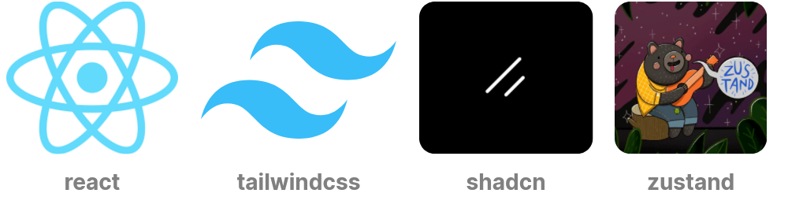

# classattend

An online attendance management application for a university context.
This is also my class project for the Distributed Systems class (BIT 322) at Cavendish University, Uganda

---

## Table of contents

- [Project background](#project-background)
- [Technologies used](#technologies-used)
  - [Backend](#backend)
  - [Frontend](#frontend)
- [How to run the application](#how-to-run-the-application)
  - [For Unix (Linux & Mac)](#for-unix-linux--mac)
  - [For Windows](#for-windows)

## Project background

Student attendance at the university is currently being done with physical pen and paper.
\
While this is a simple and elegant way to capture information, it reveals its shortcomings in the context of:

- **Large classes**
\
Students often find themselves hunting down the singular attendance sheet that's propagating around the classroom

- **Online students**
\
Students who study online do not have access to the physical paper, and so a workaround is often required to take
\
their attendance

- **Attendance history**

- Individual students often do not have a direct way to keep track of their own attendance history, which would otherwise
\
help them make better decisions about when to use their absences.

- Individual lecturers often do not have attendance history of students at their fingertips, which would help make
better decisions
\
the revolve around academic metrics and so forth

---

Classattend aims to help fill some of these gaps by allowing:

- Lecturers to open attendance-taking sessions to allow students to take attendance
- Students (both physical and online) to take attendance for open sessions
- Both students and lecturers to have access to attendance-taking history

## Technologies used

### Frontend

On the frontend, I currently use:

- [React](https://react.dev/)
- [Tailwind](https://react.dev/) for css styles
- [shadcn](https://ui.shadcn.com/) for ui components
- [zustand](https://zustand.docs.pmnd.rs/getting-started/introduction) for application state

## Backend

On the backend, I currently use:

- [Flask](https://flask.palletsprojects.com/en/stable/) for  the application server
- [FlaskSQLAlchemy](https://flask-sqlalchemy.readthedocs.io/en/stable/), that uses [SQLAlchemy](https://www.sqlalchemy.org/) to communicate with a small [SQLite3](https://www.sqlite.org/index.html) database

## How to run the application

### [For Unix (Linux & Mac)](docs/readme/unix_install.md)

### [For Windows](docs/readme/windows_install.md)
